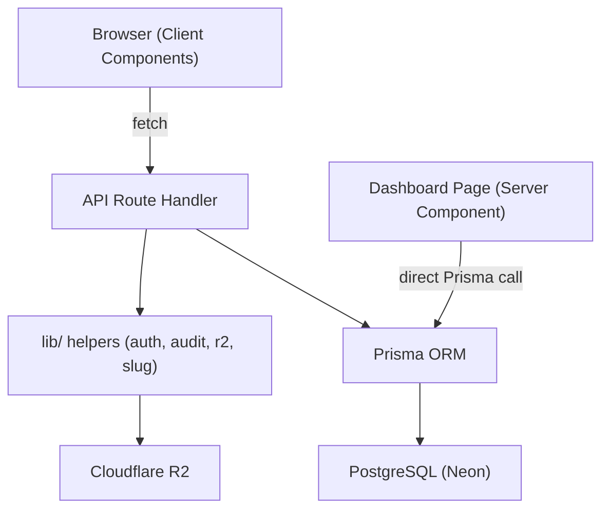

# Design Document: Land Management CRUD

## Overview

This document describes the technical design for complete CRUD operations across all 19 Prisma models in the Demo Properties land management system. The implementation follows established patterns already present in the codebase and extends them with proper validation, audit logging, status transition enforcement, R2 file lifecycle management, and auto-calculated fields.

The system is a Next.js 14 App Router application. All list views use TanStack Table via the shared `CrudTable` component. All forms use shadcn/ui Dialog/Sheet with React Hook Form + Zod. API routes follow the pattern established in `app/api/admin/regions/`.

---

## Architecture

### Layer Diagram



### Request Flow

1. Server component page fetches initial data directly via Prisma and passes it as props to a client component.
2. Client component renders a `CrudTable` (or custom table) with the initial data.
3. Mutations (create/update/delete) go through API routes via `fetch`.
4. API routes authenticate via `getServerSession`, validate with Zod, execute Prisma operations, write AuditLog entries, and return JSON.
5. Client component updates local state optimistically and shows Sonner toasts.

### Route Organization

```
app/api/
  admin/                    ← ADMIN-only reference data
    regions/route.ts + [id]/route.ts
    districts/route.ts + [id]/route.ts
    counties/route.ts + [id]/route.ts
    subcounties/route.ts + [id]/route.ts
    streets/route.ts + [id]/route.ts
    roads/route.ts + [id]/route.ts
    categories/route.ts + [id]/route.ts
    tenures/route.ts + [id]/route.ts
  users/route.ts + [id]/route.ts          ← ADMIN user management
  properties/route.ts + [id]/route.ts
    [id]/status/route.ts
    [id]/owners/route.ts + [ownerId]/route.ts
  documents/upload-url/route.ts + [id]/route.ts
  valuations/route.ts + [id]/route.ts
    [id]/payments/route.ts
  transactions/route.ts + [id]/route.ts
    [id]/status/route.ts
  disputes/route.ts + [id]/route.ts
    [id]/notes/route.ts + [noteId]/route.ts
  workflow-steps/route.ts + [id]/route.ts
  audit-logs/route.ts
```

---

## Components and Interfaces

### Shared Utilities (`lib/`)

**`lib/auth-guard.ts`** — reusable session check helper:
```ts
export function requireRole(session: Session | null, ...roles: UserRole[]): NextResponse | null
// Returns NextResponse 401 if session is missing or role not in roles, else null
```

**`lib/audit.ts`** — AuditLog writer:
```ts
export async function writeAudit(params: {
  actorId: string;
  action: string;           // "CREATE" | "UPDATE" | "DELETE" | "STATUS_CHANGE"
  entityType: string;
  entityId: string;
  propertyId?: string;
  transactionId?: string;
  oldValue?: object;
  newValue?: object;
  ip?: string;
}): Promise<void>
```

**`lib/slug.ts`** — slug generator:
```ts
export function toSlug(name: string): string
// "My Category" → "my-category"
```

**`lib/receipt.ts`** — receipt number generator:
```ts
export async function generateReceiptNumber(): Promise<string>
// Returns "RCP-YYYYMMDD-XXXX" where XXXX is zero-padded daily count
```

**`lib/status-transitions.ts`** — allowed transition maps:
```ts
export const PROPERTY_TRANSITIONS: Record<PropertyStatus, PropertyStatus[]>
export const TRANSACTION_TRANSITIONS: Record<TransactionStatus, TransactionStatus[]>
export const DISPUTE_TRANSITIONS: Record<DisputeStatus, DisputeStatus[]>
export const WORKFLOW_TRANSITIONS: Record<WorkflowStatus, WorkflowStatus[]>

export function isValidTransition(
  map: Record<string, string[]>,
  from: string,
  to: string
): boolean
```

**`lib/r2.ts`** (extend existing) — add delete:
```ts
export async function deleteR2Object(key: string): Promise<void>
```

### Dashboard Pages

Each dashboard page is a Next.js server component that:
1. Checks session and redirects if unauthorized
2. Fetches initial data via Prisma
3. Renders a heading + client component

Pattern:
```tsx
// app/dashboard/[section]/page.tsx
export default async function Page() {
  const session = await getServerSession(authOptions);
  if (!session || !["ADMIN"].includes(session.user.role)) redirect("/dashboard");
  const data = await db.model.findMany({ ... });
  return <ClientComponent data={data} />;
}
```

### Client Components

**Reference data** (Regions, Districts, Counties, Subcounties, Streets, Roads, Categories, Tenures) — use the existing `CrudTable` component with a `fields` config array. These are simple enough that no custom dialog is needed.

**Complex entities** (Users, Properties, PropertyOwners, Documents, Valuations, TaxPayments, Transactions, Disputes, WorkflowSteps, AuditLogs) — use custom client components with dedicated dialog components.

#### Dialog Components to Create

| Component | Path |
|---|---|
| `UserDialog` | `components/dashboard/dialogs/UserDialog.tsx` |
| `ValuationDialog` | `components/dashboard/dialogs/ValuationDialog.tsx` |
| `TaxPaymentDialog` | `components/dashboard/dialogs/TaxPaymentDialog.tsx` |
| `TransactionDialog` | `components/dashboard/dialogs/TransactionDialog.tsx` |
| `DisputeDialog` | `components/dashboard/dialogs/DisputeDialog.tsx` |
| `WorkflowStepDialog` | `components/dashboard/dialogs/WorkflowStepDialog.tsx` |
| `DocumentUploadDialog` | `components/dashboard/dialogs/DocumentUploadDialog.tsx` |
| `OwnerDialog` | `components/dashboard/dialogs/OwnerDialog.tsx` |

All dialogs share this interface pattern:
```tsx
interface DialogProps {
  open: boolean;
  onClose: () => void;
  onSaved: (item: any) => void;
  editItem?: any;           // present for edit mode
  context?: any;            // e.g. propertyId for nested dialogs
}
```

All dialogs use `useForm` with `zodResolver`, submit via `fetch`, and call `onSaved` with the returned record.

### CrudTable Extension

The existing `CrudTable` handles simple fields. For complex entities, a `ComplexTable` pattern is used — a custom client component that wraps TanStack Table directly (as `AdminPropertiesTable` does) and renders custom dialogs.

---

## Data Models

### Status Transition Maps

```
PropertyStatus:
  DRAFT           → [PENDING_APPROVAL]
  PENDING_APPROVAL → [ACTIVE, DRAFT]
  ACTIVE          → [TRANSFERRED, DISPUTED, ARCHIVED]
  TRANSFERRED     → []  (terminal)
  DISPUTED        → [ACTIVE, ARCHIVED]
  ARCHIVED        → []  (terminal)

TransactionStatus:
  INITIATED       → [UNDER_REVIEW, CANCELLED]
  UNDER_REVIEW    → [APPROVED, REJECTED, CANCELLED]
  APPROVED        → [COMPLETED, CANCELLED]
  COMPLETED       → []  (terminal)
  REJECTED        → []  (terminal)
  CANCELLED       → []  (terminal)

DisputeStatus:
  FILED               → [UNDER_INVESTIGATION, DISMISSED]
  UNDER_INVESTIGATION → [HEARING, DISMISSED]
  HEARING             → [RESOLVED, DISMISSED]
  RESOLVED            → []  (terminal)
  DISMISSED           → []  (terminal)

WorkflowStatus:
  PENDING  → [APPROVED, REJECTED, SKIPPED]
  APPROVED → []  (terminal)
  REJECTED → []  (terminal)
  SKIPPED  → []  (terminal)
```

### Auto-Calculated Fields

| Field | Model | Formula |
|---|---|---|
| `slug` | PropertyCategory | `toSlug(name)` — regenerated on name update |
| `taxAmount` | Valuation | `valuedAmount × taxRate` — recalculated on valuedAmount or taxRate update |
| `receiptNumber` | TaxPayment | `RCP-YYYYMMDD-XXXX` — generated at creation, immutable |
| `status` | Property (on dispute) | Set to `DISPUTED` when a Dispute is filed against it |
| `completedDate` | Transaction | Set to `now()` when status reaches `COMPLETED` |
| `resolvedAt` | Dispute | Set to `now()` when status reaches `RESOLVED` |
| `completedAt` | WorkflowStep | Set to `now()` when status reaches terminal state |
| `endDate` | PropertyOwner | Set to `now()` on soft-delete |

### Zod Validation Schemas

Each API route validates its request body with a Zod schema. Key schemas:

```ts
// Valuation
const valuationSchema = z.object({
  propertyId: z.string().cuid(),
  valuedAmount: z.number().positive(),
  taxRate: z.number().min(0).max(1),
  notes: z.string().optional(),
});

// TaxPayment
const taxPaymentSchema = z.object({
  amount: z.number().positive(),
  method: z.string().default("CASH"),
  notes: z.string().optional(),
});

// Transaction
const transactionSchema = z.object({
  propertyId: z.string().cuid(),
  type: z.enum(["SALE","LEASE","TRANSFER","MORTGAGE"]),
  buyerId: z.string().cuid().optional(),
  sellerId: z.string().cuid().optional(),
  amount: z.number().positive().optional(),
  currency: z.string().default("UGX"),
  agreementDate: z.string().datetime().optional(),
  notes: z.string().optional(),
});

// Dispute
const disputeSchema = z.object({
  propertyId: z.string().cuid(),
  complainantId: z.string().cuid(),
  title: z.string().min(3),
  description: z.string().min(10),
});
```

---

## Correctness Properties

*A property is a characteristic or behavior that should hold true across all valid executions of a system — essentially, a formal statement about what the system should do. Properties serve as the bridge between human-readable specifications and machine-verifiable correctness guarantees.*

### Property 1: Auth guard on all admin write routes

*For any* HTTP write request (POST, PATCH, DELETE) to any `/api/admin/*` route made without a valid ADMIN session, the response status should be 401.

**Validates: Requirements 1.6, 2.6, 3.5, 4.5, 5.5, 6.5, 7.6, 8.5**

---

### Property 2: Ordered GET responses

*For any* set of Region records in the database, a GET to `/api/admin/regions` should return them ordered by name ascending.

**Validates: Requirements 1.1**

---

### Property 3: Duplicate name returns 409

*For any* reference model (Region, District, County, Subcounty, TenureType, PropertyCategory) where a record with a given name already exists, a POST with the same name (and same parent key where applicable) should return HTTP 409.

**Validates: Requirements 1.5, 2.5, 3.2, 7.5, 8.2**

---

### Property 4: Slug derivation invariant

*For any* category name string, the auto-generated slug should equal the name lowercased with all whitespace sequences replaced by single hyphens and non-alphanumeric characters removed.

**Validates: Requirements 7.2, 7.3**

---

### Property 5: Password never exposed

*For any* User record returned by any API route, the response JSON should not contain a `passwordHash` field.

**Validates: Requirements 9.1**

---

### Property 6: Password storage round-trip

*For any* plaintext password submitted to create or update a user, the stored `passwordHash` should satisfy `bcrypt.compare(plaintext, hash) === true` and should not equal the plaintext string.

**Validates: Requirements 9.2**

---

### Property 7: Creation side effects invariant

*For any* successful Property creation, the database should contain exactly one WorkflowStep with `propertyId` matching the new property and `status = PENDING`, and exactly one AuditLog entry with `entityType = "Property"` and `action = "CREATE"`.

*For any* successful Transaction creation, the same invariant holds for `entityType = "Transaction"`.

**Validates: Requirements 10.2, 15.2**

---

### Property 8: Status transition enforcement

*For any* status change request on Property, Transaction, Dispute, or WorkflowStep, if the requested `(from, to)` pair is not in the allowed transition map, the API should return HTTP 422. If the pair is allowed, the update should succeed.

**Validates: Requirements 10.5, 10.6, 15.3, 15.4, 16.3, 16.4, 18.3**

---

### Property 9: Share percentage invariant

*For any* property, the sum of `sharePercentage` across all active PropertyOwner records should never exceed 100.

**Validates: Requirements 11.2, 11.3**

---

### Property 10: Tax amount calculation invariant

*For any* Valuation record, `taxAmount` should equal `valuedAmount × taxRate` (within floating-point precision).

**Validates: Requirements 13.2, 13.3**

---

### Property 11: Receipt number format invariant

*For any* TaxPayment record, the `receiptNumber` should match the regex `^RCP-\d{8}-\d{4}$`.

**Validates: Requirements 14.2**

---

### Property 12: TaxPayment immutability

*For any* existing TaxPayment, a PATCH request that includes `amount` or `receiptNumber` fields should return HTTP 422.

**Validates: Requirements 14.4**

---

### Property 13: Dispute side effect on property

*For any* property, filing a Dispute against it should result in the property's `status` being set to `DISPUTED`.

**Validates: Requirements 16.2**

---

### Property 14: Resolution requires non-empty text

*For any* Dispute status change to `RESOLVED` where the `resolution` field is absent or blank, the API should return HTTP 422.

**Validates: Requirements 16.5, 16.6**

---

### Property 15: Blank note rejected

*For any* string composed entirely of whitespace, a POST to `/api/disputes/[id]/notes` with that string as the note body should return HTTP 400.

**Validates: Requirements 17.3**

---

### Property 16: Terminal state timestamps

*For any* entity that reaches a terminal status (Transaction → COMPLETED, Dispute → RESOLVED, WorkflowStep → APPROVED/REJECTED/SKIPPED), the corresponding timestamp field (`completedDate`, `resolvedAt`, `completedAt`) should be non-null after the transition.

**Validates: Requirements 15.5, 16.5, 18.4**

---

### Property 17: AuditLog written on all audited mutations

*For any* create, update, or delete operation on Property, Transaction, Dispute, User (role/ninVerified change), or WorkflowStep, an AuditLog entry should exist with the correct `entityType`, `entityId`, `actorId`, and `action`.

**Validates: Requirements 9.5, 19.3**

---

### Property 18: AuditLog filter correctness

*For any* combination of filter parameters (`entityType`, `propertyId`, `transactionId`, `actorId`) passed to `GET /api/audit-logs`, all returned records should satisfy every provided filter condition.

**Validates: Requirements 19.1**

---

### Property 19: Zod validation rejects invalid inputs

*For any* form submission where a required field is absent or a field value violates its Zod schema constraint, the client should not submit the request and should display an inline error message below the offending field.

**Validates: Requirements 20.6, 20.7**

---

## Error Handling

### API Route Error Pattern

All API routes follow this structure:

```ts
export async function POST(req: NextRequest) {
  // 1. Auth check
  const session = await getServerSession(authOptions);
  const authError = requireRole(session, "ADMIN", "LAND_OFFICER");
  if (authError) return authError;

  try {
    // 2. Parse + validate body
    const body = await req.json();
    const parsed = schema.safeParse(body);
    if (!parsed.success) {
      return NextResponse.json({ error: parsed.error.flatten() }, { status: 400 });
    }

    // 3. Business logic (uniqueness checks, transition validation, etc.)
    // 4. Prisma operation
    // 5. Side effects (AuditLog, WorkflowStep, R2 delete)
    // 6. Return result

  } catch (err: any) {
    if (err.code === "P2002") {
      return NextResponse.json({ error: "Record already exists" }, { status: 409 });
    }
    return NextResponse.json({ error: err.message || "Server error" }, { status: 500 });
  }
}
```

### Prisma Error Codes

| Code | Meaning | HTTP Status |
|---|---|---|
| `P2002` | Unique constraint violation | 409 |
| `P2025` | Record not found | 404 |
| `P2003` | Foreign key constraint | 422 |

### R2 Deletion Failure

When `DELETE /api/documents/[id]` is called:
1. Attempt `deleteR2Object(doc.r2Key)`
2. If R2 throws, log to `console.error` but continue
3. Always delete the DB record
4. Return 200

### Status Transition Failure

When an invalid transition is submitted, return:
```json
{ "error": "Invalid status transition from DRAFT to ACTIVE" }
```
with HTTP 422.

---

## Testing Strategy

### Dual Testing Approach

Both unit tests and property-based tests are required. They are complementary:
- Unit tests cover specific examples, integration points, and edge cases
- Property tests verify universal correctness across randomized inputs

### Property-Based Testing

**Library**: `fast-check` (TypeScript-native, works with Jest/Vitest)

**Configuration**: Each property test runs a minimum of 100 iterations (`numRuns: 100`).

**Tag format**: Each test is tagged with a comment:
```ts
// Feature: land-management-crud, Property N: <property_text>
```

Each correctness property above maps to exactly one property-based test. Key examples:

```ts
// Feature: land-management-crud, Property 4: Slug derivation invariant
it("slug derivation invariant", () => {
  fc.assert(fc.property(
    fc.string({ minLength: 1 }),
    (name) => {
      const slug = toSlug(name);
      expect(slug).toMatch(/^[a-z0-9-]*$/);
      expect(slug).toBe(name.toLowerCase().replace(/\s+/g, "-").replace(/[^a-z0-9-]/g, ""));
    }
  ), { numRuns: 100 });
});

// Feature: land-management-crud, Property 10: Tax amount calculation invariant
it("taxAmount = valuedAmount × taxRate", () => {
  fc.assert(fc.property(
    fc.float({ min: 0.01, max: 1e12 }),
    fc.float({ min: 0.0001, max: 1 }),
    (valuedAmount, taxRate) => {
      const taxAmount = calculateTaxAmount(valuedAmount, taxRate);
      expect(Math.abs(taxAmount - valuedAmount * taxRate)).toBeLessThan(0.01);
    }
  ), { numRuns: 100 });
});

// Feature: land-management-crud, Property 8: Status transition enforcement
it("invalid property transitions return 422", () => {
  fc.assert(fc.property(
    fc.constantFrom(...Object.keys(PROPERTY_TRANSITIONS) as PropertyStatus[]),
    fc.constantFrom(...Object.keys(PROPERTY_TRANSITIONS) as PropertyStatus[]),
    (from, to) => {
      const valid = isValidTransition(PROPERTY_TRANSITIONS, from, to);
      // isValidTransition must agree with the transition map
      expect(valid).toBe(PROPERTY_TRANSITIONS[from].includes(to));
    }
  ), { numRuns: 200 });
});
```

### Unit Tests

Unit tests focus on:
- `lib/slug.ts` — specific name → slug examples including edge cases (empty, all-special-chars, unicode)
- `lib/receipt.ts` — format correctness, daily counter increment
- `lib/status-transitions.ts` — all valid and invalid transition pairs for each entity
- `lib/auth-guard.ts` — null session, wrong role, correct role
- API route integration tests using `msw` or Next.js test utilities for:
  - Document deletion with R2 failure (Property 12.3 example)
  - AuditLog write-on-create (Property 17 example)
  - `POST /api/audit-logs` returns 405 (Property 19.2 example)

### Test File Structure

```
__tests__/
  lib/
    slug.test.ts
    receipt.test.ts
    status-transitions.test.ts
    auth-guard.test.ts
  api/
    properties.test.ts
    valuations.test.ts
    transactions.test.ts
    disputes.test.ts
    audit-logs.test.ts
  properties/
    slug.property.test.ts       ← Property 4
    tax-calc.property.test.ts   ← Property 10
    transitions.property.test.ts ← Property 8
    receipt.property.test.ts    ← Property 11
    share-pct.property.test.ts  ← Property 9
    zod-validation.property.test.ts ← Property 19
```
